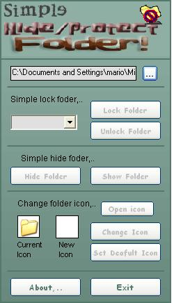



## Hide/Protect a Folder

### Description

this application shows you how to protect/hided a folder easily,.. please vote if you like it xD,..
 
### More Info
 

             |
---                |---
**Submitted On**   |2004-02-13 22:14:52
**By**             |[Oscar David ](https://github.com/Planet-Source-Code/PSCIndex/blob/master/ByAuthor/oscar-david.md)
**Level**          |Intermediate
**User Rating**    |4.0 (16 globes from 4 users)
**Compatibility**  |VB 5\.0, VB 6\.0
**Category**       |[Coding Standards](https://github.com/Planet-Source-Code/PSCIndex/blob/master/ByCategory/coding-standards__1-43.md)
**World**          |[Visual Basic](https://github.com/Planet-Source-Code/PSCIndex/blob/master/ByWorld/visual-basic.md)
**Archive File**   |[Hide\_Prote1711732212004\.zip](https://github.com/Planet-Source-Code/oscar-david-hide-protect-a-folder__1-51925/archive/master.zip)

